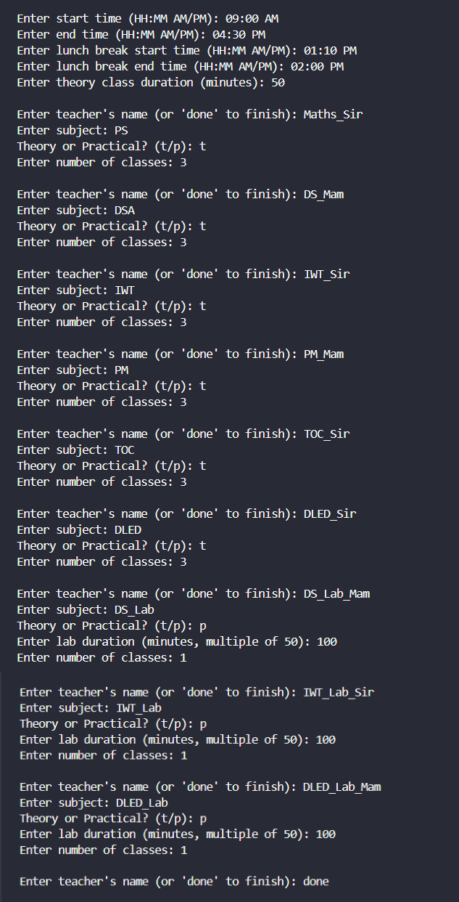
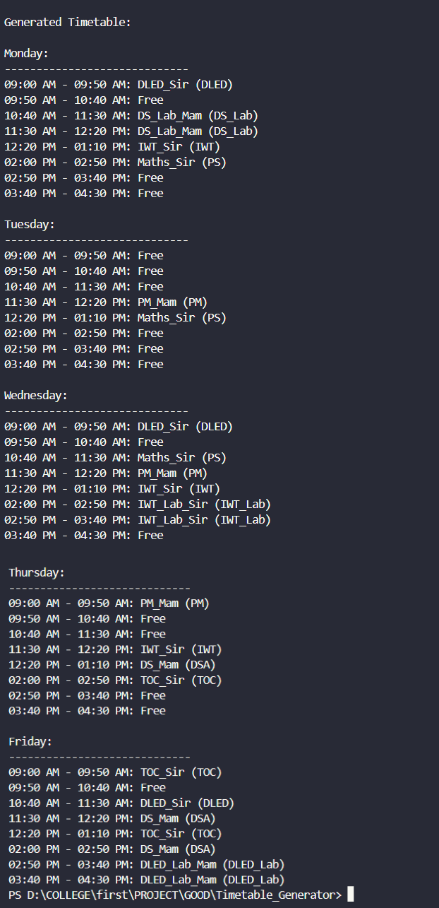

<h1 align="center">📅✨ C++ College Timetable Generator</h1>

<p align="center">
  
  
  
</p>

<p align="center">
  🏫 Automatically generate a weekly college timetable for theory and practical classes using C++.<br/>
  Handles slot conflicts, lunch breaks, variable durations, and ensures randomized class distribution!
</p>

---

## 🛠️ Features

- 🕒 Customizable college hours & class durations
- 🍱 Lunch break handling
- 👨‍🏫 Theory & practical class support
- 🔀 Randomized class distribution to avoid repetition
- ✅ Conflict-free automatic scheduling
- 📋 Clean timetable printout by day & time

---

## 📸 Demo

### 🖼️ Inputs


### 🖼️ Generated Table


## 📦 Installation

### 1. Clone the Repository

```bash
    git clone https://github.com/yourusername/timetable-generator.git
    cd timetable-generator
```
### 2. Compile

```bash
    g++ -o timetable main.cpp
```
### 3. Run

```bash
    ./timetable
```

## 📁 Project Structure

    📦 timetable-generator/
    ┣ 📄 image1.png       → Inputs Image
    ┣ 📄 image2.png       → Table Generated Image
    ┣ 📄 main.cpp         → Core program logic
    ┣ 📄 README.md        → Project documentation


## ✏️ Customization Tips <br>

> • Modify vector<string> days to include Saturday/Sunday <br>
> • Add teacher availability logic if needed <br>
> • Expand Teacher struct to include class preference, room number, etc. <br>

## 💡 Tech Stack <br>

> • 💻 C++17<br>
> • 🧠 STL: vector, string, tuple, algorithm, sstream<br>

## 🤝 Contributing

  • Feel free to fork and submit pull requests!<br>
  • Let’s make the best open-source timetable scheduler togethe

## 📜 License

  This project is licensed under the MIT License.

### 🌟 Show your support

  ⭐ Star this repo if it helped you or your institution!
